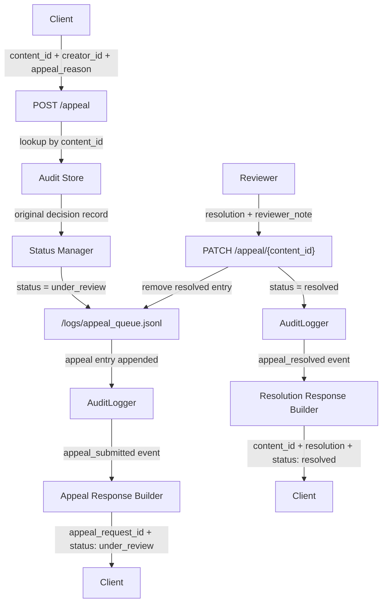

## Provenance Guard Introduction
Provenance Guard is a backend API that any creative platform could plug into to classify whether submitted content was written by a human or generated by AI, score confidence in that classification, surface a transparency label to users, and handle appeal from creators who believe they've been misclassified. It also has to rate-limit, has structured audit logging for every decision, and handle uncertainty honestly — because the hardest design challenge here isn't detection accuracy, it's what to do when you're not sure.


## Architecture Narrative
This section describes the lifecycle of a single piece of submitted text, from the moment a creator clicks "Submit" to the transparency label displayed to readers.

#### 1. Content Submission
- A creator submits text (such as a poem, blog post, or story excerpt) to the Content Submission API.
- Component: **POST /submit** 
- Technology: `Flask API`
- Responsibilities: 
    - Accept the submitted text.
    - Generate a unique content ID (contentID exists for the entire lifecycle of that content)
    - Record submission metadata (timestamp, request ID - which exists only for that specific HTTP request, clientID - may use IP address to identify client).
    ```
    Example of contentID vs requestID: A creator submits a poem (POST /submit)
     => Request ID: req_001
        Content ID: content_123

    The system then classifies it as AI-generated. Later the creator files an appeal (POST /appeal)
     => Request ID: req_002
        Content ID: content_123
    ```
    - Pass the request into the attribution pipeline.
- Before any analysis begins, the request is checked by the rate limiter.


#### 2. Rate Limiting
- The request first passes through the Rate Limiting Service.
- Component: **RateLimiter**
- Technology: `Flask-Limiter`
- Responsibilities:
    - Prevent abuse and excessive API usage.
    - Track requests per clientID/IP.
    - Reject requests that exceed configured limits.
        ```
        Example response:
        {
            "error": "Rate limit exceeded"
        }
        ```
    - If the request is allowed, the text proceeds to the detection pipeline.

#### 3. Multi-Signal Detection Pipeline
- The text is analyzed using two independent attribution signals.
    - **Signal A: LLM-Based Classification** - useful because modern language models can recognize broad writing patterns, coherence structures, and stylistic traits.
        - Component: **LLMClassifier**
        - Technology: Groq-hosted LLM - `llama-3.3-70b-versatile`
        - Responsibilities:
            - Read the text and evaluate whether the writing appears more likely human-authored or AI-generated.
            - Capture high-level semantic and stylistic patterns that are difficult to express as rules.
            ```
            Example output:
            {
            "prediction": "AI",
            "confidence": 0.82
            }
            ```
        - What properties it measures: Overall writing pattern—coherence, tone consistency, structure, and “AI-likeness” of the full text.
        - Why there properties differ between human and AI writing: AI text tends to be uniformly polished and predictable. Human writing is more irregular, with uneven tone, structure shifts, and personal phrasing.
        - what it can't capture: It judges appearance, not origin. Polished human writing (e.g., journalism) can be mislabeled as AI, and AI-edited text can look human.

    - **Signal B: Stylometric Analysis** - provides an explainable, deterministic perspective that does not rely on another AI model.
        - Component: **StylometricAnalyzer**
        - Technology: Pure Python, no external libraries needed
        - Responsibilities:
            - Compute measurable statistical properties of the text.
            - Identify patterns often associated with AI-generated writing (e.g Sentence length variance, Type-token ratio (vocabulary diversity), Punctuation density, Average sentence complexity, etc. )
            ```
            Example output:
            {
                "prediction": "Human",
                "confidence": 0.65,
                "metrics": {
                    "sentence_variance": 12.4,
                    "type_token_ratio": 0.74
                }
            }
            ```
        - What properties it measures: Statistical features of text—sentence length variance, vocabulary diversity, punctuation density, and complexity.
        - Why there properties differ between human and AI writing: Human writing is more variable and inconsistent. AI writing is often more uniform unless explicitly prompted otherwise.
        - Blind spot: It ignores meaning entirely. Short texts are unreliable, and AI can mimic human-like statistics with prompting or editing.

#### 4. Signal Fusion and Confidence Assessment
- The outputs from both detectors are sent to the ConfidenceEvaluator to interpret the combined confidence score. This step is critical because Provenance Guard is designed to handle uncertainty honestly rather than forcing every piece of content into a human-or-AI bucket.
- Component: **ConfidenceEvaluator**
- Responsibilities:
    - Combine the results from all signals from step 3 into a single confidence score (0.00-1.00)
    - product final prediction (AI, Human, or uncertain)
- Input:
    - LLM prediction + confidence
    - Stylometric prediction + confidence
    ```
    Example:
        Signal	     Prediction	   Confidence
        LLM		       AI	    	    0.82
        Stylometric	   Human	    	0.65

    => Because the signals disagree, the Decision Engine lowers overall confidence and may classify the result as uncertain.

    => Possible output:
        {
            "classification": "uncertain",
            "confidence": 0.58
        }
    ```
- Example thresholds:
    - 0.85 - 1.00 -> High confidence
    - 0.60 - 0.84 -> Moderate confidence
    - Below 0.60 -> Uncertain


#### 5. Transparency Label Generation
- The final classification is converted into reader-facing language. This is the label that would be shown to readers on a creative platform.
- Component: **LabelGenerator**
- Responsibilities:
    - Translate technical results into plain English.
    - Communicate confidence clearly.
    - Avoid overstating certainty.
    ``` 
    Example: High-Confidence AI Label
        => label: Likely AI-Generated
        Our system found strong indicators that this content was generated using AI tools.
        Confidence: 95%

    Example: High-Confidence Human Label
        => label: Likely Human-Written
        Our system found strong indicators that this content was written by a human author.
        Confidence: 92%

    Example: Uncertain Label
        => label: Attribution Uncertain
        Our system could not confidently determine whether this content was written by a human or generated by AI.
        Confidence: 58%
    ```

#### 6. Audit Logging
- Before returning the response, the system records the decision to support future investigations, debugging, and appeal. This ensures every decision is explainable and traceable.
- Component: AuditLogger
- Technology: `SQLite` (built-in) (can also use `structured JSON` (JSONL))
- Responsibilities:
    - Create an immutable record of the analysis in a file in `/logs` folder.
    - Store metadata of each request
    - Store result of each signal and of the final classification and confidence.
    ```
    Example audit entry:

    {
        "event_type": "classification",
        "creator_id": "abc",
        "content_id": "cnt_123",
        "request_id": "xyz_123"
        "timestamp": "2026-06-24T18:30:00Z",
        "text": "text content"
        "text_length": 13
        "llm_result": {
            "prediction": "AI",
            "confidence": 0.82
        },
        "stylometric_result": {
            "prediction": "Human",
            "confidence": 0.65
        },
        "final_classification": "uncertain",
        "confidence": 0.58,
        "status" : "final | under_review | appealed"
    }
    ```

#### 7. API Response Returned
- The API returns a structured response to the platform. The platform can immediately display the transparency label to readers.
    ```
    Example:
        {
            "content_id": "cnt_123",
            "classification": "uncertain",
            "confidence": 0.58,
            "label": {
                "title": "Attribution Uncertain",
                "message": "Our system could not confidently determine whether this content was written by a human or generated by AI."
            }
        }
    ```


#### 8. appeal Workflow (Post-Decision)
- If a creator believes the result is incorrect, they can submit an appeal.
- Component: **POST /appeal**, **PATCH /appeal/{content_id}**
- Technology: `Flask API`
- Responsibilities:
    - Accept the creator's explanation.
    - Link the appeal to the original content.
    - **Dual logging on appeal submission:**
        - Log an `appeal_submitted` audit event to `/logs/audit.db` (creates immutable record in decision history via GET /audit/{content_id})
        - Append the appeal item to `/logs/appeal_queue.jsonl` (active queue for reviewers to manage pending appeal)
    - On resolution (PATCH /appeal/{content_id}): update the content status, log a resolution audit event to `/logs/audit.db`, and remove the entry from `/logs/appeal_queue.jsonl`.

    ```
    Example flow — submitting an appeal:
    Request:
        {
            "content_id": "cnt_123",
            "creator_id": "abc",
            "appeal_reason": "I wrote this essay myself and can provide drafts."
        }

    => The system generates a new request ID for the appeal:
        Original Analysis Request: request_id = req_001
        Appeal Request: request_id = req_002

    Retrieve Original Decision via content_id = cnt_123:
        {
            "creator_id": "abc",
            "content_id": "cnt_123",
            "request_id": "req_001",
            "final_classification": "uncertain",
            "confidence": 0.58,
            "text": "<original text>"
        }

    => Dual logging (simultaneous writes):

    (1) Create Appeal Audit Record in /logs/audit.db:
        {
            "event_type": "appeal_submitted",
            "creator_id": "abc",
            "content_id": "cnt_123",
            "request_id": "req_002",
            "original_request_id": "req_001",
            "timestamp": "2026-06-25T14:10:00Z",
            "text": "I wrote this essay myself and can provide drafts.",
            "text_length": 48,
            "llm_result": NULL,
            "stylometric_result": NULL,
            "final_classification": NULL,
            "confidence": NULL,
            "status": "under_review"
        }

    (2) Append to /logs/appeal_queue.jsonl (for active queue management):
        {
            "appeal_request_id": "req_002",
            "content_id": "cnt_123",
            "creator_id": "abc",
            "original_request_id": "req_001",
            "original_classification": "uncertain",
            "original_confidence": 0.58,
            "appeal_reason": "I wrote this essay myself and can provide drafts.",
            "text": "<original text>",
            "submitted_at": "2026-06-25T14:10:00Z",
            "status": "pending_review"
        }

    Example flow — resolving an appeal:
    Request (PATCH /appeal/cnt_123):
        {
            "resolution": "overturned",
            "reviewer_note": "Creator provided original drafts confirming human authorship."
        }

    => Dual operations:
    
    (1) Remove cnt_123 entry from /logs/appeal_queue.jsonl (clears from active review queue)
    
    (2) Update content status to "resolved" in /logs/audit.db
    
    (3) Create Resolution Audit Record in /logs/audit.db:
        {
            "event_type": "appeal_resolved",
            "content_id": "cnt_123",
            "request_id": "req_003",
            "original_request_id": "req_001",
            "timestamp": "2026-06-26T09:00:00Z",
            "text": "Creator provided original drafts confirming human authorship.",
            "text_length": 60,
            "llm_result": NULL,
            "stylometric_result": NULL,
            "final_classification": "Human",
            "confidence": NULL,
            "status": "resolved"
        }
    ```


## API Contract

#### 1. POST /submit
- Purpose: Submit text for AI-vs-human attribution analysis.
- Request:
    {
        "creator_id": "abc",
        "text": "string content here"
    }
- Response:
    {
        "content_id": "cnt_123",
        "request_id": "req_001",
        "classification": "AI | Human | uncertain",
        "confidence": 0.0,
        "label": "high_confidence_ai | high_confidence_human | uncertain",
    }

#### 2. POST /appeal
- Purpose: 
    - Allow creators to appeal a classification
    - update the content's status field to "under review" in the sqlite DB (check audit_logger.py to see the log schema)
    - log the appeal in the audit log (the log schema is defined in audit_logger.py)
    - return a confirmation that the appeal was received.
- Request:
    {
        "content_id": "cnt_123",
        "creator_id": "abc",
        "creator_reasoning": "string"
    }
- Response:
    {
        "appeal_request_id": "req_002",
        "content_id": "cnt_123",
        "status": "under_review",
        "message": "Appeal submitted successfully"
    }

#### 3. PATCH /appeal/{content_id}
- Purpose: Resolve a pending appeal — updates content status and removes the entry from appeal_queue.
- Request:
    {
        "resolution": "overturned | upheld",
        "reviewer_note": "string"
    }
- Response:
    {
        "content_id": "cnt_123",
        "resolution": "overturned | upheld",
        "status": "resolved",
        "message": "Appeal resolved successfully"
    }


#### 4. GET /audit/{content_id}
- Purpose: Retrieve full decision history (event log).
- Response:
    {
        "content_id": "cnt_123",
        "events": [
            {
                "event_type": "classification",
                "creator_id": "abc",
                "content_id": "cnt_123",
                "request_id": "req_001",
                "original_request_id":  "req_001",
                "timestamp": "2026-06-24T18:30:00Z",
                "text": "text content",
                "text_length": 13
                "llm_result": {
                    "prediction": "AI",
                    "confidence": 0.82
                },
                "stylometric_result": {
                    "prediction": "Human",
                    "confidence": 0.65
                },
                "final_classification": "AI",
                "confidence": 0.58,
                "status" : "appealed"
            },
            {
                "event_type": "appeal_submitted",
                "creator_id": "abc",
                "content_id": "cnt_123",
                "request_id": "req_002",
                "original_request_id":  "req_001",
                "timestamp": "2026-06-25T10:30:00Z",
                "text": "appeal reason",
                "text_length": 13
                "llm_result": NULL
                "stylometric_result": NULL
                "final_classification": NULL,
                "confidence": NULL,
                "status" : "reviewed"
            },
            {
                "event_type": "appeal_reviewed",
                "creator_id": "abc",
                "content_id": "cnt_123",
                "request_id": "req_003",
                "original_request_id":  "req_001",
                "timestamp": "2026-06-27T9:30:00Z",
                "text": "review details",
                "text_length": 14
                "llm_result": NULL
                "stylometric_result": NULL
                "final_classification": "Human",
                "confidence": NULL,
                "status" : "final"
            }
        ]
    }

#### 5. GET /log?num_latest_logs=...
- Purpose: returns the most recent audit log entries as JSON. 
- return: jsonify({"entries": get_log()}). 


## Architecture Diagram

#### Submission Flow
The submission flow takes raw text through two independent signals—an LLM-based classifier and a stylometric analyzer—before merging their outputs in a confidence evaluator. The system then converts the combined score into a user-facing transparency label, logs a full audit record, and returns the final attribution result to the client.


#### Appeal Flow
The appeal flow covers two operations: a creator submitting a dispute and a reviewer resolving it. On submission, the system retrieves the original audit record, marks the content as under review, and appends the appeal to `/logs/appeal_queue.jsonl`. On resolution, the reviewer calls `PATCH /appeal/{content_id}`, the entry is removed from the queue, and a resolution audit event is logged.




### Summary Implementation Decisions:
- **Detection signals:** What are our signals? What does each one measure? What does each signal's output look like (a score between 0–1? a binary flag?), and how will you combine them into a single confidence score?
    - We use 2 independent signals:
        1. LLM Classifier (Signal A)
        Measures: global writing patterns (coherence, fluency, stylistic “AI-likeness”).
        Output: {prediction: AI|Human, confidence: 0–1}
        Captures semantic-level judgment but is probabilistic and model-based.

        2. Stylometric Analyzer (Signal B)
        Measures: statistical properties of text (sentence length variance, type-token ratio, punctuation density, complexity).
        Output: {prediction: AI|Human, confidence: 0–1}
        Captures structural writing variability using deterministic heuristics.

    - Combination: We compute a weighted agreement score:
        Agreement → higher confidence
        Disagreement → confidence penalty
        Final output: {classification, confidence ∈ [0,1]}

- **Uncertainty representation:** What does a confidence score of 0.6 mean to your system? How will you map raw signal outputs to a calibrated score? What threshold separates "likely AI" from "uncertain" from "likely human"?
    - A score of 0.6 means the system has a weak lean toward one classification but lacks reliable signal strength — it should not confidently label the content either way.
    - Combination formula (ConfidenceEvaluator):
        - Weighted base: `base = 0.6 × LLM_confidence + 0.4 × stylometric_confidence` (LLM weighted higher as it captures semantics)
        - If both signals agree on prediction: `final_confidence = base`
        - If signals disagree: `final_confidence = base × 0.77` (disagreement penalty)
        - Example: LLM=AI/0.82, Stylometric=Human/0.65 → base = 0.6×0.82 + 0.4×0.65 = 0.752 → with penalty: 0.752 × 0.77 ≈ 0.58 (uncertain)
    - Threshold mapping:
        - ≥ 0.85: High confidence → label as AI or Human (strong indicators message)
        - 0.60 – 0.84: Moderate confidence → label as AI or Human (hedged "analysis suggests" message)
        - < 0.60: Uncertain → cannot confidently classify

- **Transparency label design:** What exact text will the label show for a high-confidence AI result? A high-confidence human result? An uncertain result? Write out the three label variants now, before you build the UI.
    - **Label A — High-Confidence AI** (`label: "high_confidence_ai"`, confidence ≥ 0.85, prediction = AI)
        ```
        title: "Likely AI-Generated"
        message: "Our system found strong indicators that this content was generated using AI tools."
        ```
    - **Label B — High-Confidence Human** (`label: "high_confidence_human"`, confidence ≥ 0.85, prediction = Human)
        ```
        title: "Likely Human-Written"
        message: "Our system found strong indicators that this content was written by a human author."
        ```
    - **Label C — Moderate Confidence** (`label: "high_confidence_ai"` or `"high_confidence_human"`, confidence 0.60–0.84)
        ```
        title: "Possibly AI-Generated" / "Possibly Human-Written"
        message: "Our analysis leans toward this content being [AI-generated / human-written], but the signal is not strong enough to be certain."
        ```
    - **Label D — Uncertain** (`label: "uncertain"`, confidence < 0.60)
        ```
        title: "Attribution Uncertain"
        message: "Our system could not confidently determine whether this content was written by a human or generated by AI."
        ```
        
- **appeal workflow:** Who can submit an appeal? What information do they provide? What does the system do when an appeal is received — what status changes, what gets logged? What would a human reviewer see when they open the appeal queue?
    - **Who can appeal:** Any creator identified by `creator_id` whose content received a classification they dispute.
    - **What they provide:** `content_id`, `creator_id`, and `appeal_reason` (free-text explanation).
    - **What the system does on receipt:**
        1. Generates a new `request_id` for the appeal (e.g. `req_002`).
        2. Retrieves the original audit record via `content_id`.
        3. Updates original content status to `under_review` in the audit database.
        4. **Dual logging for traceability and usability:**
           - Logs an `appeal_submitted` audit event to `/logs/audit.db` (creates permanent, immutable record in the content's decision history accessible via `GET /audit/{content_id}`)
           - Appends a structured entry to `/logs/appeal_queue.jsonl` (active work queue for reviewers to manage pending appeal; each line contains original text, classification, confidence, appeal reason, and status)
    - **What a human reviewer sees in the queue:** Each line of `appeal_queue.jsonl` is one pending appeal with the full context needed to decide — original text, classification result, confidence score, and the creator's explanation. Reviewers use this file as their active queue; once resolved, the entry is removed from the queue but remains in the audit database history.
    - **On resolution (PATCH /appeal/{content_id}):**
        1. Entry removed from `/logs/appeal_queue.jsonl` (clears from active review queue).
        2. Original content status updated to `resolved` in the audit database.
        3. `appeal_resolved` audit event logged to `/logs/audit.db` with resolution (`overturned` or `upheld`) and reviewer note (creates permanent record in the content's decision history).

- **Anticipated edge cases:** What types of content will your system handle poorly? Name at least two specific scenarios.
    1. **AI-polished human drafts:** A writer drafts a blog post then uses ChatGPT to smooth grammar and flow. The final text retains the human's ideas but exhibits AI-like phrasing uniformity. Both signals agree it's AI — high confidence — but creative origin was human.
    2. **Formulaic professional writing:** A human-written legal brief uses repetitive passive constructions, consistent clause structure, and formal boilerplate. Stylometrics score it as AI-like due to low sentence variance; the LLM may agree because the prose pattern resembles AI-generated formal text. False positive for an entire genre of human writing.
    3. **Very short texts:** A two-sentence product description or single-stanza poem gives the stylometric analyzer almost no data — sentence variance and type-token ratio are unreliable under ~50 words. The system defaults to "uncertain" regardless of actual origin.


## AI Tool Plan
- **Milestone 3 (submission endpoint + first signal):** I'm gonna provide to the AI tool my detection signals section in "### Summary Implementation Decisions" and in "#### 3. Multi-Signal Detection Pipeline" + the architecture diagram. With those contexts, I can ask it to generate:
    (1) the Flask app skeleton with the POST /submit route stub
    (2) the first signal function. 
I'll verify the signal function by checking that the function signature matches my spec's description of what the signal returns and running the function directly with some random inputs and inspect the output before wiring into the endpoint. If no issue shown, I'll verify that the Flask route structure matches my API contract and text the API endpoint

Curl command to test:
```
  curl -s -X POST http://localhost:5000/submit \
  -H "Content-Type: application/json" \
  -d '{"text": "The sun dipped below the horizon, painting the sky in hues of amber and rose. I sat on the porch, coffee in hand, watching the neighborhood slowly go quiet.", "creator_id": "test-user-1"}' | python -m json.tool
```

- **Milestone 4 (second signal + confidence scoring):** I'll provide the Signal B description from "#### 3. Multi-Signal Detection Pipeline", the "#### 4. Signal Fusion and Confidence Assessment" section, and the "Uncertainty representation" answer from "### Summary Implementation Decisions". With those, I'll ask it to generate:
    (1) the StylometricAnalyzer function (sentence variance, type-token ratio, punctuation density)
    (2) the ConfidenceEvaluator combining logic using the weighted formula: `base = 0.6 x LLM_conf + 0.4 x stylo_conf`, with `x 0.77` penalty on disagreement, and the three threshold buckets.
I'll verify by running both signals on two contrasting texts — one clearly AI-sounding (uniform, polished, no personality) and one clearly human-sounding (irregular structure, informal phrasing) — and manually checking that:
    - the combined confidence is higher when both signals agree
    - the disagreement penalty visibly lowers the score when they diverge
    - scores below 0.60 are labeled "uncertain", not forced into AI or Human

Curl command to test the full pipeline so far:
```
  curl -s -X POST http://localhost:5000/submit \
  -H "Content-Type: application/json" \
  -d '{"text": "The quarterly earnings report demonstrates consistent revenue growth across all business units, with particular strength in the enterprise segment.", "creator_id": "test-user-1"}' | python -m json.tool
```

Prompt used: 
```
use the "Signal B: Stylometric Analysis" + "Detection signals" + "**Uncertainty representation:**" + architecture diagram in @planning.md to generate: (1) the second signal function, and (2) the confidence scoring logic that combines both signals according to the spec. Verify that the generated scoring function actually matches the threshold defined in the planning document — AI tools sometimes implement reasonable-looking scoring that silently diverges from our specified ranges. If it does, correct it before wiring it in. 

for the stylometric heuristics, compute 2–3 specific metrics (e.g., sentence length variance, type-token ratio, punctuation density, complexity) and decide how to combine them into a single signal score. 

For the confidence score, update submit() in @app.py to have the combined scoring logic. The logic should: vary meaningfully across clearly different inputs (a highly polished, uniform paragraph vs. a casual, irregular piece should produce different scores), and map to these 3 distinct label categories: "Likely AI-generated," "Uncertain," "Likely human-written"
```

- **Milestone 5 (label generation + appeal layer):** I'll provide "#### 5. Transparency Label Generation", the label design variants from "### Summary Implementation Decisions", the full "#### 8. appeal Workflow" section, and the API contract for `POST /appeal` and `PATCH /appeal/{content_id}`. With those, I'll ask it to generate:
    (1) the LabelGenerator function mapping (classification, confidence) -> (label key, title, message)
    (2) the `POST /appeal` route that appends to `/logs/appeal_queue.jsonl` and logs an `appeal_submitted` audit event
    (3) the `PATCH /appeal/{content_id}` route that removes the resolved entry from the queue and logs an `appeal_resolved` audit event
I'll verify by:
    - Crafting inputs with mocked confidence values to trigger each label tier (>=0.85 AI, >=0.85 Human, 0.60-0.84, <0.60) and confirming the correct title and message appear in the response
    - Calling `POST /appeal` and checking that `/logs/appeal_queue.jsonl` gains a new line with the correct `content_id` and `status: pending_review`
    - Calling `PATCH /appeal/{content_id}` with a resolution and checking that the entry is gone from the queue and the audit log has an `appeal_resolved` event

Curl commands to test:
```
  # Submit an appeal
  curl -s -X POST http://localhost:5000/appeal \
  -H "Content-Type: application/json" \
  -d '{"content_id": "cnt_123", "creator_id": "test-user-1", "appeal_reason": "I wrote this myself and have drafts."}' | python -m json.tool

  # Resolve the appeal
  curl -s -X PATCH http://localhost:5000/appeal/cnt_123 \
  -H "Content-Type: application/json" \
  -d '{"resolution": "overturned", "reviewer_note": "Creator provided original drafts."}' | python -m json.tool
```