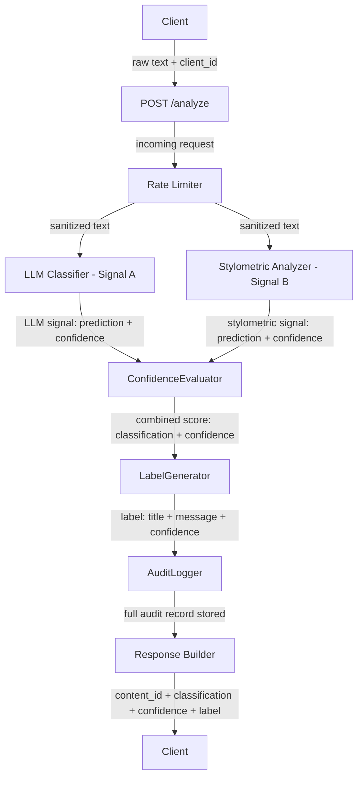
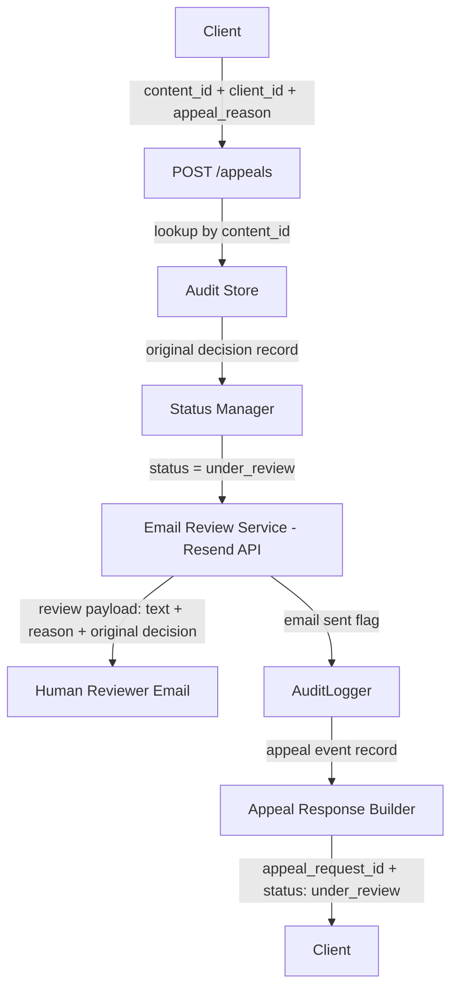

### Provenance Guard Introduction
Provenance Guard is a backend API that any creative platform could plug into to classify whether submitted content was written by a human or generated by AI, score confidence in that classification, surface a transparency label to users, and handle appeals from creators who believe they've been misclassified. It also has to rate-limit, has structured audit logging for every decision, and handle uncertainty honestly — because the hardest design challenge here isn't detection accuracy, it's what to do when you're not sure.


### Architecture Narrative
This section describes the lifecycle of a single piece of submitted text, from the moment a creator clicks "Submit" to the transparency label displayed to readers.

#### 1. Content Submission
- A creator submits text (such as a poem, blog post, or story excerpt) to the Content Submission API.
- Component: **POST /analyze** 
- Technology: `Flask API`
- Responsibilities: 
    - Accept the submitted text.
    - Generate a unique content ID (contentID exists for the entire lifecycle of that content)
    - Record submission metadata (timestamp, request ID - which exists only for that specific HTTP request, clientID - may use IP address to identify client).
    ```
    Example of contentID vs requestID: A creator submits a poem (POST /analyze)
     => Request ID: req_001
        Content ID: content_123

    The system then classifies it as AI-generated. Later the creator files an appeal (POST /appeals)
     => Request ID: req_002
        Content ID: content_123
    ```
    - Pass the request into the attribution pipeline.
- Before any analysis begins, the request is checked by the rate limiter.


#### 2. Rate Limiting
- The request first passes through the Rate Limiting Service.
- Component: **RateLimiter**
- Technology: `Flask-Limiter`
- Responsibilities:
    - Prevent abuse and excessive API usage.
    - Track requests per clientID/IP.
    - Reject requests that exceed configured limits.
        ```
        Example response:
        {
            "error": "Rate limit exceeded"
        }
        ```
    - If the request is allowed, the text proceeds to the detection pipeline.

#### 3. Multi-Signal Detection Pipeline
- The text is analyzed using two independent attribution signals.
    - **Signal A: LLM-Based Classification** - useful because modern language models can recognize broad writing patterns, coherence structures, and stylistic traits.
        - Component: **LLMClassifier**
        - Technology: Groq-hosted LLM - `llama-3.3-70b-versatile`
        - Responsibilities:
            - Read the text and evaluate whether the writing appears more likely human-authored or AI-generated.
            - Capture high-level semantic and stylistic patterns that are difficult to express as rules.
            ```
            Example output:
            {
            "prediction": "AI",
            "confidence": 0.82
            }
            ```
        - What properties it measures: Overall writing pattern—coherence, tone consistency, structure, and “AI-likeness” of the full text.
        - Why there properties differ between human and AI writing: AI text tends to be uniformly polished and predictable. Human writing is more irregular, with uneven tone, structure shifts, and personal phrasing.
        - what it can't capture: It judges appearance, not origin. Polished human writing (e.g., journalism) can be mislabeled as AI, and AI-edited text can look human.

    - **Signal B: Stylometric Analysis** - provides an explainable, deterministic perspective that does not rely on another AI model.
        - Component: **StylometricAnalyzer**
        - Technology: Pure Python, no external libraries needed
        - Responsibilities:
            - Compute measurable statistical properties of the text.
            - Identify patterns often associated with AI-generated writing (e.g Sentence length variance, Type-token ratio (vocabulary diversity), Punctuation density, Average sentence complexity, etc. )
            ```
            Example output:
            {
                "prediction": "Human",
                "confidence": 0.65,
                "metrics": {
                    "sentence_variance": 12.4,
                    "type_token_ratio": 0.74
                }
            }
            ```
        - What properties it measures: Statistical features of text—sentence length variance, vocabulary diversity, punctuation density, and complexity.
        - Why there properties differ between human and AI writing: Human writing is more variable and inconsistent. AI writing is often more uniform unless explicitly prompted otherwise.
        - Blind spot: It ignores meaning entirely. Short texts are unreliable, and AI can mimic human-like statistics with prompting or editing.

#### 4. Signal Fusion and Confidence Assessment
- The outputs from both detectors are sent to the ConfidenceEvaluator to interpret the combined confidence score. This step is critical because Provenance Guard is designed to handle uncertainty honestly rather than forcing every piece of content into a human-or-AI bucket.
- Component: **ConfidenceEvaluator**
- Responsibilities:
    - Combine the results from all signals from step 3 into a single confidence score (0.00-1.00)
    - product final prediction (AI, Human, or uncertain)
- Input:
    - LLM prediction + confidence
    - Stylometric prediction + confidence
    ```
    Example:
        Signal	     Prediction	   Confidence
        LLM		       AI	    	    0.82
        Stylometric	   Human	    	0.65

    => Because the signals disagree, the Decision Engine lowers overall confidence and may classify the result as uncertain.

    => Possible output:
        {
            "classification": "uncertain",
            "confidence": 0.58
        }
    ```
- Example thresholds:
    - 0.85 - 1.00 -> High confidence
    - 0.60 - 0.84 -> Moderate confidence
    - Below 0.60 -> Uncertain


#### 5. Transparency Label Generation
- The final classification is converted into reader-facing language. This is the label that would be shown to readers on a creative platform.
- Component: **LabelGenerator**
- Responsibilities:
    - Translate technical results into plain English.
    - Communicate confidence clearly.
    - Avoid overstating certainty.
    ``` 
    Example: High-Confidence AI Label
        => label: Likely AI-Generated
        Our system found strong indicators that this content was generated using AI tools.
        Confidence: 95%

    Example: High-Confidence Human Label
        => label: Likely Human-Written
        Our system found strong indicators that this content was written by a human author.
        Confidence: 92%

    Example: Uncertain Label
        => label: Attribution Uncertain
        Our system could not confidently determine whether this content was written by a human or generated by AI.
        Confidence: 58%
    ```

#### 6. Audit Logging
- Before returning the response, the system records the decision to support future investigations, debugging, and appeals. This ensures every decision is explainable and traceable.
- Component: AuditLogger
- Technology: `SQLite` (built-in) or `structured JSON` (JSONL)
- Responsibilities:
    - Create an immutable record of the analysis in a file in `/logs` folder.
    - Store metadata of each request
    - Store result of each signal and of the final classification and confidence.
    ```
    Example audit entry:

    {
    "event_type": "classification",
    "client_id": "abc",
    "content_id": "cnt_123",
    "request_id": "xyz_123"
    "timestamp": "2026-06-24T18:30:00Z",
    "text": "text content"
    "text_length": 13
    "llm_result": {
        "prediction": "AI",
        "confidence": 0.82
    },
    "stylometric_result": {
        "prediction": "Human",
        "confidence": 0.65
    },
    "final_classification": "uncertain",
    "confidence": 0.58
    }
    ```

#### 7. API Response Returned
- The API returns a structured response to the platform. The platform can immediately display the transparency label to readers.
    ```
    Example:
        {
            "content_id": "cnt_123",
            "classification": "uncertain",
            "confidence": 0.58,
            "label": {
                "title": "Attribution Uncertain",
                "message": "Our system could not confidently determine whether this content was written by a human or generated by AI."
            }
        }
    ```


#### 8. Appeals Workflow (Post-Decision)
- If a creator believes the result is incorrect, they can submit an appeal.
- Component: **POST /appeals**
- Technology: `Flask API`, `Resend API`
- Responsibilities:
    - Accept the creator's explanation.
    - Link the appeal to the original content.
    - Send Review Email to a decidated human-review email using Resend API, including the original content, attribution result, and creator's reasoning to the reviewer.
    - call the AuditLogger to add Appeal Audit Record

    ```
    Example flow:
    Request: 
        {
            "content_id": "cnt_123",
            "appeal_reason": "I wrote this essay myself and can provide drafts."
        }
    => The system generates a new request ID for the appeal:
        Original Analysis Request: request_id = req_001
        Appeal Request: request_id = req_002

    Then Retrieve Original Decision: The Appeal Service locates the original audit entry using: content_id = cnt_123
        This retrieves:
        {
            "client_id": "abc",
            "content_id": "cnt_123",
            "request_id": "req_001",
            ...
        }
    
    Then send email to the reviewer:
        Subject: Provenance Guard Appeal Review

        Content ID: cnt_123
        Original Request ID: req_001

        Original Classification:
        uncertain (0.58)

        Creator Appeal:
        "I wrote this essay myself and can provide drafts."

        Content:
        -------------------
        <text content here>
        -------------------
    
    System then create Appeal Audit Record:
        {
            "event_type": "appeal_submitted",
            "client_id": "abc",
            "content_id": "cnt_123",
            "request_id": "req_002",
            "related_request_id": "req_001",
            "timestamp": "2026-06-25T14:10:00Z",
            "appeal_reason": "I wrote this essay myself and can provide drafts.",
            "status": "under_review"
        }
    ```

------------------

### API Contract

#### 1. POST /analyze
- Purpose: Submit text for AI-vs-human attribution analysis.
- Request:
    {
        "client_id": "abc",
        "text": "string content here"
    }
- Response:
    {
        "content_id": "cnt_123",
        "request_id": "req_001",
        "classification": "AI | Human | uncertain",
        "confidence": 0.0,
        "label": "high_confidence_ai | high_confidence_human | uncertain",
        "description": "string"
    }

#### 2. POST /appeals
- Purpose: Allow creators to contest a classification and trigger human review.
- Request:
    {
        "content_id": "cnt_123",
        "client_id": "abc",
        "appeal_reason": "string"
    }
- Response:
    {
        "appeal_request_id": "req_002",
        "content_id": "cnt_123",
        "status": "under_review",
        "message": "Appeal submitted successfully"
    }

#### 3. GET /content/{content_id}
- Purpose: Fetch latest attribution result for a piece of content.
- Response:
    {
        "content_id": "cnt_123",
        "latest_classification": "uncertain",
        "confidence": 0.58,
        "status": "final | under_review | appealed",
        "last_updated": "timestamp"
    }

4. GET /audit/{content_id}
- Purpose: Retrieve full decision history (event log).
- Response:
    {
        "content_id": "cnt_123",
        "events": [
            {
            "event_type": "classification",
            "request_id": "req_001",
            "confidence": 0.58
            },
            {
            "event_type": "appeal_submitted",
            "request_id": "req_002",
            "related_request_id": "req_001"
            }
        ]
    }


### Architecture Diagram

#### Submission Flow


#### Appeal Flow
